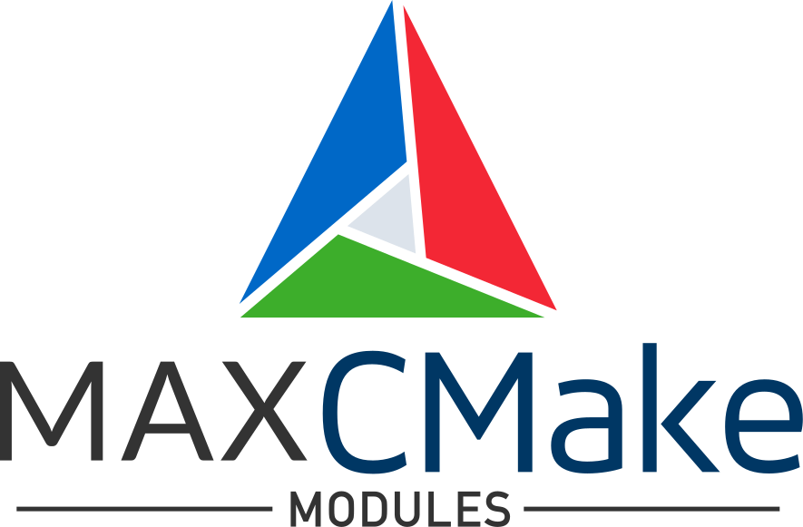

<p align="center">
    
</p>

CMake Modules for Max Package Development
=========================================

Find Modules
------------
There are three find modules that can be used to find libraries and create CMake targets.
* `FindMaxAPI`
* `FindMinAPI`
* `FindMinLib`

Usually the modules are put into a `cmake` folder and this directory is added to the `CMAKE_MODULE_PATH`.
```cmake
list(APPEND CMAKE_MODULE_PATH ${CMAKE_SOURCE_DIR}/cmake)
```

It is recommended that you add the repository into the `cmake` folder as a submodule and then symlink the find modules.
```
pushd cmake
git submodule add https://github.com/ascii255/max-cmake-modules.git Max
ln -s Max/FindModules/FindMaxAPI.cmake FindMaxAPI.cmake
ln -s Max/FindModules/FindMinAPI.cmake FindMinAPI.cmake
ln -s Max/FindModules/FindMinLib.cmake FindMinLib.cmake
popd
```

The CMake targets will be created using
```cmake
find_package(MaxAPI REQUIRED)
find_package(MinAPI REQUIRED)
find_package(MinLib REQUIRED)
```

The module will look for the repositories somewhere in the `${CMAKE_SOURCE_DIR}`. It is recommended to have the 
[min-api](https://github.com/Cycling74/min-api) and optionally the [min-lib](https://github.com/Cycling74/min-lib) 
added as a submodule to the package git repository.

```
git submodule add https://github.com/Cycling74/min-api.git
git submodule add https://github.com/Cycling74/min-lib.git
```

The `find_package` funtions will fill the variables
* `MaxAPI_LIBRARIES`, `MaxAPI_INCLUDE_DIRS`
* `MinAPI_LIBRARY`, `MinAPI_INCLUDE_DIR`
* `MinLib_LIBRARY`, `MinLib_INCLUDE_DIR`

and the targets
* `MaxAPI::Core`, `MaxAPI::Audio`, `MaxAPI::Jitter`
* `MinAPI::MinAPI`
* `MinLib::MinLib`

To link the targets use
```cmake
target_link_libraries(${EXTERNAL_TARGET} PRIVATE ${MaxAPI_LIBRARIES} ${MinAPI_LIBRARY})
```

For the `MaxAPI` module components can be listed.
```cmake
find_package(MaxAPI REQUIRED COMPONENTS Core Audio)
```

Utility Modules
---------------
These modules will help to configure a project as a Max package. It can be seen as an alternative to using the
[min-devkit](https://github.com/Cycling74/min-devkit).

### ParsePackageInfo
This module will parse the [`package-info.json`](https://docs.cycling74.com/max8/vignettes/package_info_json) file that 
is also part of the resulting Max package. The module will fill the CMake variables
* `PACKAGE_NAME`
* `PACKAGE_DISPLAY_NAME`
* `PACKAGE_VERSION`
* `PACKAGE_AUTHOR`
* `PACKAGE_DESCRIPTION`
* `PACKAGE_WEBSITE`
* `PACKAGE_REVERSE_DOMAIN`
* `PACKAGE_COPYRIGHT` (`(c)` will be replaced by `©`)

These variables can then be used to create a project for the Max package.
```cmake
include(Max/ParsePackageInfo)
parse_package_info(${CMAKE_SOURCE_DIR}/package-info.json)

project(${PACKAGE_NAME}
    VERSION ${PACKAGE_VERSION}
    DESCRIPTION ${PACKAGE_DESCRIPTION}
    HOMEPAGE_URL ${PACKAGE_WEBSITE}
    LANGUAGES CXX
)
```

### AddExternal
This module will add a target configured to be build as a Max external.
```cmake
include(Max/AddExternal)
add_external(${EXTERNAL_TARGET} ${EXTERNAL_NAME}
    VERSION ${PACKAGE_VERSION}
    REVERSE_DOMAIN ${PACKAGE_REVERSE_DOMAIN}
    COPYRIGHT ${PACKAGE_COPYRIGHT}
)
```

If the variables `PACKAGE_VERSION`, `PACKAGE_REVERSE_DOMAIN`, `PACKAGE_COPYRIGHT` have been set or there was a previous 
call to the `parse_package_info` macro of the `ParsePackageInfo` module that set them, the optional arguments can be 
omitted.
```cmake
add_external(${EXTERNAL_TARGET} ${EXTERNAL_NAME})
```
